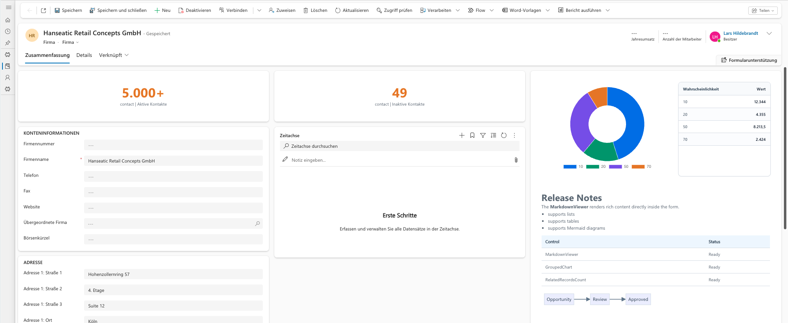

# Controls Overview

The solution currently contains three PCF controls.

## Controls

- [MarkdownViewer](./markdown-viewer.md)
- [GroupedChart](./grouped-chart.md)
- [RelatedRecordsCount](./related-records-count.md)

## Shared Behavior

- all controls are packaged into the same Dataverse solution
- background rendering can be controlled via `showBackgroundColor` where supported
- builds and tests are run from the repository root
