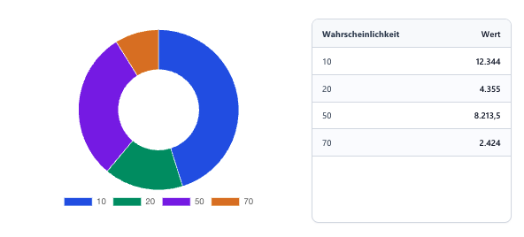

# GroupedChart

`GroupedChart` is a dataset-based chart control for model-driven apps.

## Purpose

- groups dataset records by a configured field
- visualizes grouped values as a chart
- can optionally show values next to the chart

## Configuration

### Dataset

| Name | Type | Notes |
| --- | --- | --- |
| `chartData` | dataset | Selects the table and view that provide the chart records. |

### Properties

| Name | Type | Usage | Required | Notes |
| --- | --- | --- | --- | --- |
| `chartType` | `Enum` | `input` | yes | Selects which chart visualization is rendered. |
| `groupByField` | `SingleLine.Text` | `input` | yes | Logical name of the field used for grouping. |
| `aggregationMode` | `Enum` | `input` | yes | Selects whether numeric values are aggregated as sum or average. |
| `valueField` | `SingleLine.Text` | `input` | yes | Logical name of the numeric field to aggregate. |
| `showDataNextToChart` | `TwoOptions` | `input` | no | Shows a data list next to the chart. |
| `showBackgroundColor` | `TwoOptions` | `input` | no | Controls whether the themed background is shown. |

### Enum Values

`chartType`

| Value |
| --- |
| `Doughnut` |
| `HalfDoughnut` |
| `Pie` |
| `FunnelVertical` |
| `FunnelHorizontal` |

`aggregationMode`

| Value |
| --- |
| `Sum` |
| `Average` |

## Supported Chart Types

- `Doughnut`
- `HalfDoughnut`
- `Pie`
- `FunnelVertical`
- `FunnelHorizontal`
