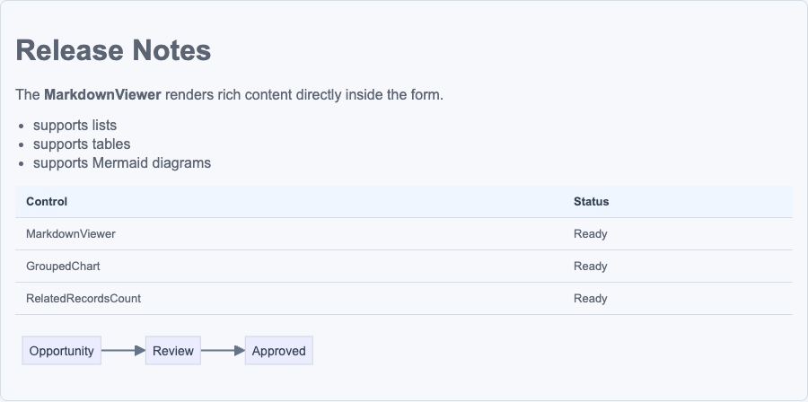

# MarkdownViewer

`MarkdownViewer` is a field-based PCF control for model-driven apps.

## Purpose

- renders Markdown from a bound multiline field
- can optionally render manually configured Markdown instead of the field value
- supports Mermaid diagrams in fenced code blocks

## Configuration

| Name | Type | Usage | Required | Notes |
| --- | --- | --- | --- | --- |
| `value` | `Multiple` | `bound` | yes | Bound multiline text field that provides the Markdown content by default. |
| `markdownText` | `Multiple` | `input` | no | Optional manual Markdown override. |
| `showBackgroundColor` | `TwoOptions` | `input` | no | Controls whether the themed background is shown. |

## Notes

- supports tables, task lists, and horizontal rules
- Mermaid rendering is included in the control
